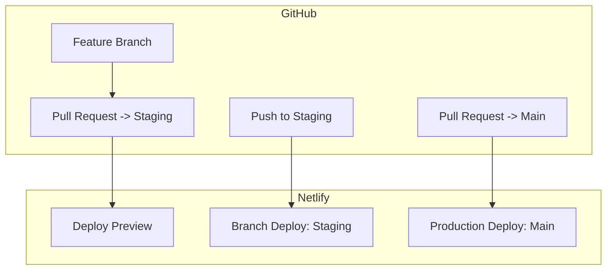

# Kumar Software

This is a [Next.js](https://nextjs.org) project bootstrapped with [`create-next-app`](https://nextjs.org/docs/app/api-reference/cli/create-next-app), deployed on **Netlify** with separate staging and production environments.

---

## 🚀 Getting Started

### Local Development

To run the development server:

```bash
npm run dev
# or
yarn dev
# or
pnpm dev
```

Open [http://localhost:3000](http://localhost:3000) in your browser to see the result.

Start editing the page by modifying `app/page.tsx`. The page auto-updates as you edit the file.

---

## 🌿 Project Structure

- `app/`: Next.js App Router entry point
- `components/`: Reusable UI components
- `styles/`: Global and scoped styles
- `public/`: Static assets

---

## 🔨 Technologies Used

- [Next.js](https://nextjs.org/) (App Router)
- [React](https://reactjs.org/)
- [`next/font`](https://nextjs.org/docs/app/building-your-application/optimizing/fonts) for optimized fonts ([Geist](https://vercel.com/font))
- [TypeScript](https://www.typescriptlang.org/) for static typing
- [Netlify](https://www.netlify.com/) for CI/CD and hosting

---

## 🚢 Deployment Workflow (Netlify)

This project uses **Netlify for continuous deployment** with two main environments:

### 📦 Production

- **Branch:** `main`
- **URL:** [https://kumar-software.netlify.app](https://kumar-software.netlify.app)
- **Behavior:** Every push/merge to `main` triggers an automatic deploy to production.

### 🧪 Staging

- **Branch:** `staging`
- **Behavior:** Every push to `staging` triggers an automatic **Branch Deploy** on Netlify (preview environment).
- Used for review/testing before merging to `main`.

### 🔍 Deploy Previews

- Any pull request targeting `main` or `staging` will trigger a **Deploy Preview** for easier review and QA.

---

## 🔁 Recommended Workflow



- Work in feature branches.
- Open a PR targeting `staging` for review and staging deploy.
- Once approved, merge `staging` → `main` for production deploy.

---

## 💡 Notes

- Ensure environment variables are configured correctly for both **staging** and **production** in Netlify’s UI.
- Check Netlify deploy logs if you encounter build issues (`npm run build` must succeed in CI).

---

## 📖 Learn More

- [Next.js Documentation](https://nextjs.org/docs)
- [Netlify Docs](https://docs.netlify.com/)
- [Learn Next.js](https://nextjs.org/learn)

---

👋 **Contributions welcome!**  
Feel free to fork this repo, submit pull requests, or open issues if you find bugs or have feature ideas.
